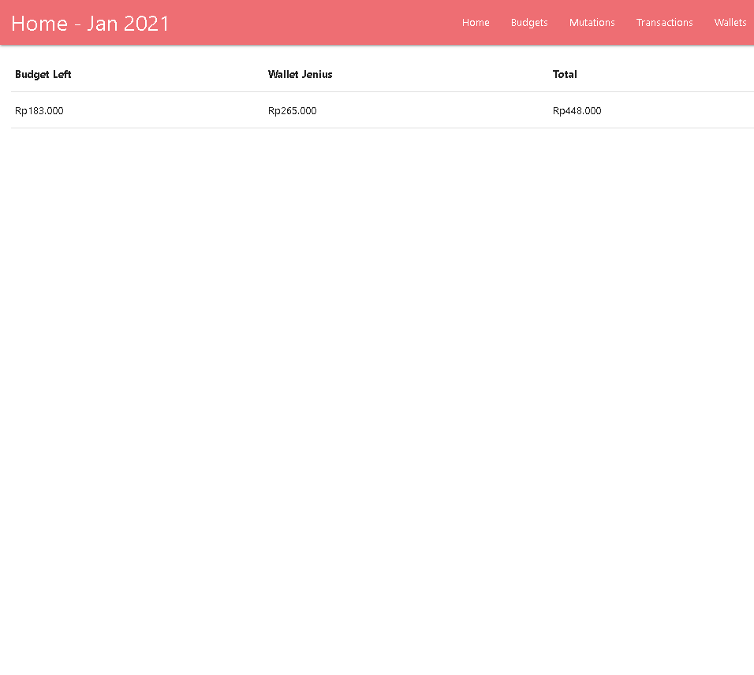

# Finance Manager

Simple local web app for maintaing my salary by record all monthly budgets and transactions. There is wallet which is separated from budget and can be mutated from wallet to wallet or from wallet to hand (i use the money).

## Layout

All layouts are extended from [base.html](/templates/base.html). Title on top-left with contains period and menus on top-right side. All page should define `title` and `onload_function` variables and add `page_script` block if needed.

### Period

Period is defined as which month and year of my current salary. Since my salary day at 27th, period Jan 2021 means from 27th Dec to 26th Jan. Each page only show current period.

### Homepage

Hompage directly extends [base.html](/templates/base.html). Homepage contains total budget left for current period, current wallet [Jenius](https://www.jenius.com/) balance, and total of these two.

### Tabular Page

Each menu pages is page with table which extends [base_table.html](/templates/base_table.html). There is floating action button which open form page to add corresponding model. Each Tabular page should define `onload_function` to load all data and fill it inside `table-body`. `table_header` block should be defined with same column as `table-body`. Floating action button should be redirected to add form which defined as `table_add_link` variable.

### Form Page

Each form page extends [base_form.html](/templates/base_form.html). Some Materialize component should be initialized inside `onload_function`. Submission is not using form submit, it use API Call inside `submitForm()` function.

## Tech Stack
- Backend
  - [Flask v1.1.1](https://pypi.org/project/Flask/1.1.1/)
  - [Flask Migrate v2.5.3](https://pypi.org/project/Flask-Migrate/2.5.3/)
  - [Flask SQLAlchemy v2.4.4](https://pypi.org/project/Flask-SQLAlchemy/2.4.4/)
- DB: SQLite
- Frontend:
  - [Jinja v2.11.x](https://jinja.palletsprojects.com/en/2.11.x/)
  - [Materialize](https://materializecss.com/)
